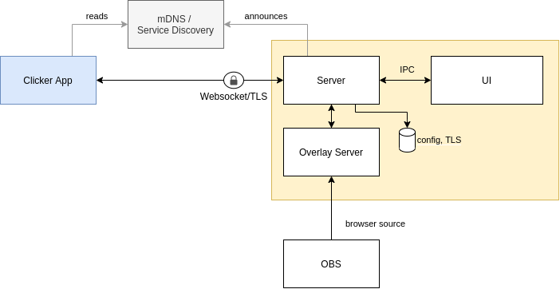

# fcl-app

This is a desktop and mobile app that lets you track foosball matches and integrates into OBS to display a scoreboard and statistics in a livestream.


## Overview

This Application consists of two components:
* a mobile application (only android for now)
* a desktop application



## Building

Prerequisites:
* fairly recent nodejs version (`~v15.2.1`)
* npm (`~v6`)
* make
* android sdk, gradle, java

```sh
$ make clean
$ make prepare
$ make all

# find the binaries here
$ ls -la packages/desktop/dist_electron/fcl-desktop-*
$ ls -la packages/clicker/android/app/build/outputs/apk/release/
```
